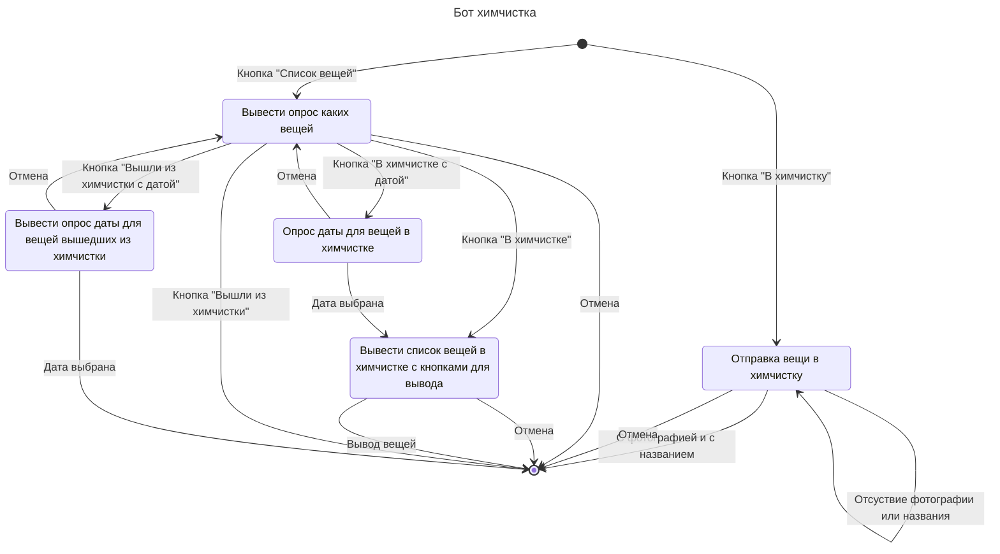

```mermaid
---
title: Бот химчистка
---
stateDiagram-v2
    sending : Отправка вещи в химчистку

    [*] --> sending : Кнопка "В химчистку"
    sending --> sending : Отсуствие фотографии или названия
    sending --> [*] : С фотографией и с названием
    sending --> [*] : Отмена


    list : Вывести опрос каких вещей
    [*] --> list : Кнопка "Список вещей"
    list --> [*] : Отмена

    incoming : Вывести список вещей в химчистке с кнопками для вывода
    dateIncoming : Опрос даты для вещей в химчистке
    list --> incoming : Кнопка "В химчистке"
    list --> dateIncoming : Кнопка "В химчистке с датой"
    dateIncoming --> incoming : Дата выбрана
    dateIncoming --> list : Отмена 
    incoming --> [*] : Отмена
    incoming --> [*] : Вывод вещей

    list --> [*] : Кнопка "Вышли из химчистки"
    dateOutgoing : Вывести опрос даты для вещей вышедших из химчистки
    list --> dateOutgoing : Кнопка "Вышли из химчистки с датой"
    dateOutgoing --> [*] : Дата выбрана
    dateOutgoing --> list : Отмена
```