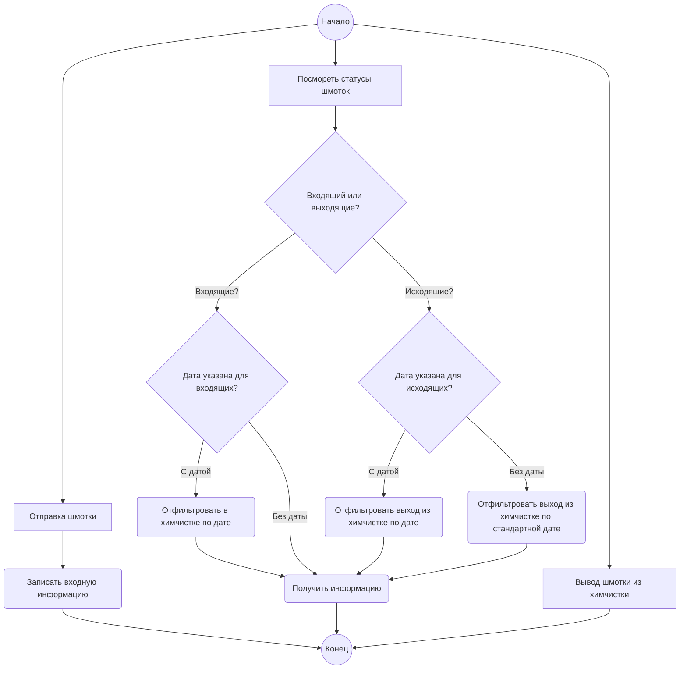

```mermaid
flowchart TD
    start((Начало)) 
    endd((Конец)) 
    
    %% Действия юзера
    sendCloth["Отправка шмотки"]
    listClothes["Посмореть статусы шмоток"]
    outCloth["Вывод шмотки из химчистки"]

    %% Действия бота    
    filterIncoimngDate("Отфильтровать в химчистке по дате")
    filterOutGoingDate("Отфильтровать выход из химчистке по дате")
    filterOutGoingDateDefault("Отфильтровать выход из химчистке по стандартной дате")
    

    getInfo("Получить информацию")

    writeIncomingInfo("Записать входную информацию") 


    %% Условия
    ifInOutilter{"Входящий или выходящие?"}
    isWithDateIncoming{"Дата указана для входящих?"}
    isWithDateOutgoing{"Дата указана для исходящих?"}

    %% Отправка
    start --> sendCloth 
    sendCloth --> writeIncomingInfo --> endd
    
    %% Информация
    start --> listClothes --> ifInOutilter 
      
    ifInOutilter --Входящие?--> isWithDateIncoming 
    isWithDateIncoming --С датой--> filterIncoimngDate
    filterIncoimngDate --> getInfo
    isWithDateIncoming --Без даты--> getInfo

    ifInOutilter --Исходящие?--> isWithDateOutgoing 
    isWithDateOutgoing --С датой--> filterOutGoingDate
    filterOutGoingDate --> getInfo

    isWithDateOutgoing --Без даты--> filterOutGoingDateDefault
    filterOutGoingDateDefault --> getInfo --> endd

    %% Вывод
    start --> outCloth --> endd
```